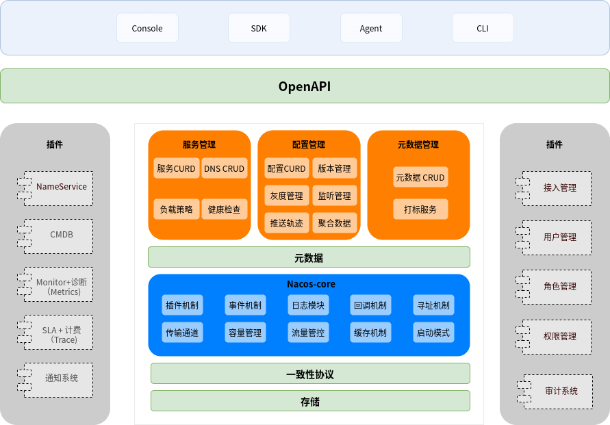
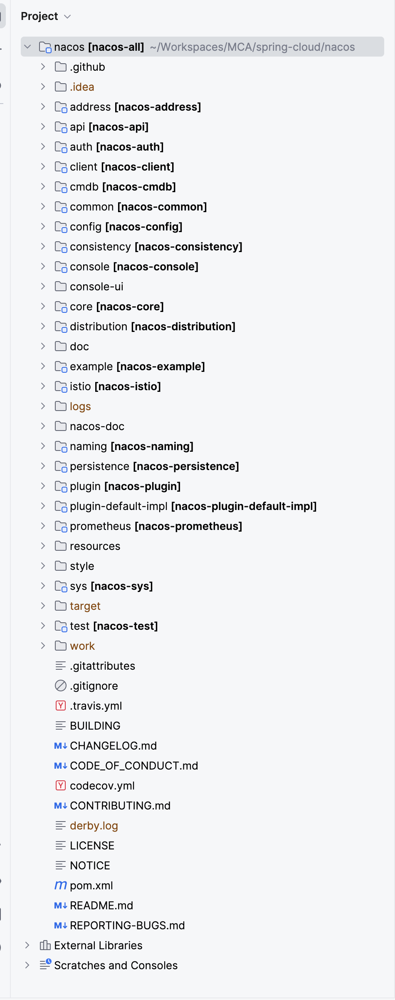
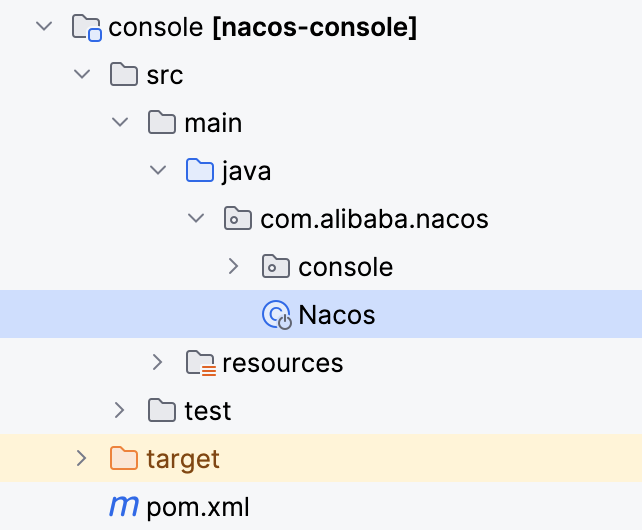
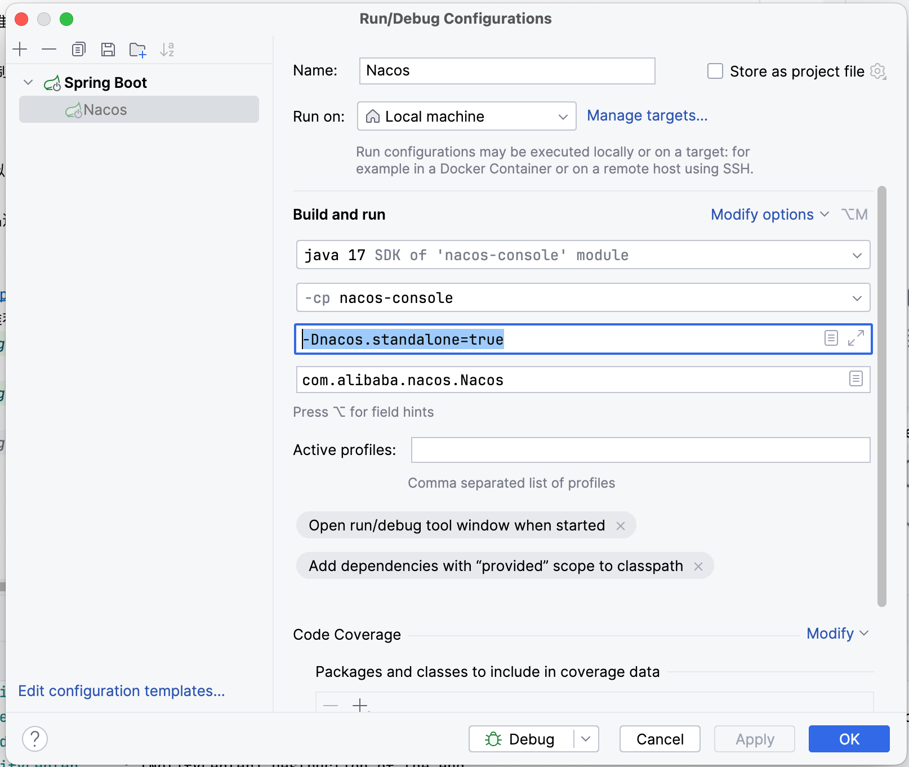

# Alibaba Nacos 简介和下载源码

内容转载自 https://nacos.io/docs/latest/architecture/

**Nacos** 是一个开源的动态服务发现、配置管理和服务管理平台。它提供了服务注册与发现、配置管理、动态路由、负载均衡等功能，帮助开发者构建和管理基于微服务架构的应用系统。

Nacos version: 2.3.1

## 基本架构及概念

- **服务 (Service)**
  服务是指一个或一组软件功能（例如特定信息的检索或一组操作的执行），其目的是不同的客户端可以为不同的目的重用（例如通过跨进程的网络调用）。Nacos 支持主流的服务生态，如 Kubernetes Service、gRPC|Dubbo RPC
  Service 或者 Spring Cloud RESTful Service。

- **服务注册中心 (Service Registry)**
  服务注册中心，它是服务，其实例及元数据的数据库。服务实例在启动时注册到服务注册表，并在关闭时注销。服务和路由器的客户端查询服务注册表以查找服务的可用实例。服务注册中心可能会调用服务实例的健康检查 API
  来验证它是否能够处理请求。

- **服务元数据 (Service Metadata)**
  服务元数据是指包括服务端点(endpoints)、服务标签、服务版本号、服务实例权重、路由规则、安全策略等描述服务的数据。

- **服务提供方 (Service Provider)**
  是指提供可复用和可调用服务的应用方。

- **服务消费方 (Service Consumer)**
  是指会发起对某个服务调用的应用方。

- **配置 (Configuration)**
  在系统开发过程中通常会将一些需要变更的参数、变量等从代码中分离出来独立管理，以独立的配置文件的形式存在。目的是让静态的系统工件或者交付物（如 WAR，JAR
  包等）更好地和实际的物理运行环境进行适配。配置管理一般包含在系统部署的过程中，由系统管理员或者运维人员完成这个步骤。配置变更是调整系统运行时的行为的有效手段之一。

- **配置管理 (Configuration Management)**
  在数据中心中，系统中所有配置的编辑、存储、分发、变更管理、历史版本管理、变更审计等所有与配置相关的活动统称为配置管理。

- **名字服务 (Naming Service)**
  提供分布式系统中所有对象(Object)、实体(Entity)的“名字”到关联的元数据之间的映射管理服务，例如 ServiceName -> Endpoints Info, Distributed Lock Name -> Lock Owner/Status Info, DNS Domain Name -> IP List,
  服务发现和 DNS 就是名字服务的2大场景。

- **配置服务 (Configuration Service)**
  在服务或者应用运行过程中，提供动态配置或者元数据以及配置管理的服务提供者。

- **地域 (Region)**
  物理的数据中心，资源创建成功后不能更换。

- **可用区 (Availability Zone)**
  同一地域内，电力和网络互相独立的物理区域。同一可用区内，实例的网络延迟较低。

- **接入点 (Access Point)**
  地域的某个服务的入口域名。

- **命名空间 (Namespace)**
  用于进行租户粒度的配置隔离。不同的命名空间下，可以存在相同的 Group 或 Data ID 的配置。Namespace 的常用场景之一是不同环境的配置的区分隔离，例如开发测试环境和生产环境的资源（如配置、服务）隔离等。

- **配置 (Configuration)**
  在系统开发过程中，开发者通常会将一些需要变更的参数、变量等从代码中分离出来独立管理，以独立的配置文件的形式存在。目的是让静态的系统工件或者交付物（如 WAR，JAR
  包等）更好地和实际的物理运行环境进行适配。配置管理一般包含在系统部署的过程中，由系统管理员或者运维人员完成。配置变更是调整系统运行时的行为的有效手段。

- **配置管理 (Configuration Management)**
  系统配置的编辑、存储、分发、变更管理、历史版本管理、变更审计等所有与配置相关的活动。

- **配置项 (Configuration Item)**
  一个具体的可配置的参数与其值域，通常以 param-key=param-value 的形式存在。例如我们常配置系统的日志输出级别（logLevel=INFO|WARN|ERROR） 就是一个配置项。

- **配置集 (Configuration Set)**
  一组相关或者不相关的配置项的集合称为配置集。在系统中，一个配置文件通常就是一个配置集，包含了系统各个方面的配置。例如，一个配置集可能包含了数据源、线程池、日志级别等配置项。

- **配置集 ID (Configuration Set ID)**
  Nacos 中的某个配置集的 ID。配置集 ID 是组织划分配置的维度之一。Data ID 通常用于组织划分系统的配置集。一个系统或者应用可以包含多个配置集，每个配置集都可以被一个有意义的名称标识。Data ID 通常采用类 Java
  包（如 com.taobao.tc.refund.log.level）的命名规则保证全局唯一性。此命名规则非强制。

- **配置分组 (Configuration Group)**
  Nacos 中的一组配置集，是组织配置的维度之一。通过一个有意义的字符串（如 Buy 或 Trade ）对配置集进行分组，从而区分 Data ID 相同的配置集。当您在 Nacos 上创建一个配置时，如果未填写配置分组的名称，则配置分组的名称默认采用
  DEFAULT_GROUP 。配置分组的常见场景：不同的应用或组件使用了相同的配置类型，如 database_url 配置和 MQ_topic 配置。

- **配置快照 (Configuration Snapshot)**
  Nacos 的客户端 SDK 会在本地生成配置的快照。当客户端无法连接到 Nacos Server 时，可以使用配置快照显示系统的整体容灾能力。配置快照类似于 Git 中的本地 commit，也类似于缓存，会在适当的时机更新，但是并没有缓存过期（expiration）的概念。

- **服务 (Service)**
  通过预定义接口网络访问的提供给客户端的软件功能。

- **服务名 (Service Name)**
  服务提供的标识，通过该标识可以唯一确定其指代的服务。

- **服务注册中心(Service Registry)**
  服务注册中心是一种用于管理和维护服务注册信息的组件。它允许服务提供者将自己的服务注册到注册中心，并允许服务消费者从注册中心获取服务的信息，以便进行服务调用。

- **服务发现 (Service Discovery)**
  服务发现是一种机制，用于在分布式系统中动态地发现和获取可用的服务实例。当服务提供者将自己的服务注册到服务注册中心时，服务消费者可以通过服务发现机制获取服务注册中心中的服务信息，从而实现服务调用。

- **负载均衡 (Load Balancing)**
  负载均衡是一种将网络流量分发到多个服务实例上的技术。它可以提高系统的可扩展性、可靠性和性能。负载均衡器会根据一定的策略选择合适的服务实例来处理请求，以实现请求的分发和负载均衡。

- **服务健康检查 (Service Health Check)**
  服务健康检查是一种机制，用于定期检查服务实例的健康状态。通过定期发送健康检查请求，服务注册中心可以获知服务实例的健康状况，并根据实际情况将不健康的服务实例从服务列表中移除，以保证服务的可用性和稳定性。

- **服务路由 (Service Routing)**
  服务路由是一种将请求从服务消费者路由到服务提供者的机制。通过服务路由，可以根据一定的规则将请求转发到不同的服务实例或服务集群，以实现请求的负载均衡、故障转移、版本控制等功能。

- **配置中心 (Configuration Center)**
  配置中心是一种用于集中管理和维护系统配置信息的组件。它允许开发者将系统的各种配置参数和变量集中存储，并提供统一的接口供系统组件和应用程序读取和更新配置信息。

## 逻辑架构及其组件介绍

- **服务管理：** 实现服务CRUD，域名CRUD，服务健康状态检查，服务权重管理等功能

- **配置管理：** 实现配置管CRUD，版本管理，灰度管理，监听管理，推送轨迹，聚合数据等功能

- **元数据管理：** 提供元数据CURD和打标能力

- **插件机制：** 实现三个模块可分可合能力，实现扩展点SPI机制

- **事件机制：** 实现异步化事件通知，SDK数据变化异步通知等逻辑

- **日志模块：** 管理日志分类，日志级别，日志可移植性（尤其避免冲突），日志格式，异常码+帮助文档

- **回调机制：** SDK通知数据，通过统一的模式回调用户处理。接口和数据结构需要具备可扩展性

- **寻址模式：** 解决IP，域名，nameserver、广播等多种寻址模式，需要可扩展

- **推送通道：** 解决server与存储、server间、server与SDK间推送性能问题

- **容量管理：** 管理每个租户，分组下的容量，防止存储被写爆，影响服务可用性

- **流量管理：** 按照租户，分组等多个维度对请求频率，长链接个数，报文大小，请求流控进行控制

- **缓存机制：** 容灾目录，本地缓存，server缓存机制。容灾目录使用需要工具

- **启动模式：** 按照单机模式，配置模式，服务模式，DNS模式或者all模式，启动不同的程序+UI

- **一致性协议：** 解决不同数据，不同一致性要求情况下的不同一致性机制

- **存储模块：** 解决数据持久化、非持久化存储，解决数据分片问题

- **Nameserver：** 解决namespace到clusterid的路由问题，解决用户环境与Nacos物理环境映射问题

- **CMDB：** 解决元数据存储，与第三方CMDB系统对接问题，解决应用、人、资源关系

- **Metrics：** 暴露标准metrics数据，方便与第三方监控系统打通

- **Trace：** 暴露标准trace，方便与SLA系统打通，日志白平化，推送轨迹等能力，可与计量计费系统打通

- **接入管理：** 相当于阿里云开通服务，分配身份、容量、权限过程

- **用户管理：** 解决用户管理、登录、SSO等问题

- **权限管理：** 解决身份识别、访问控制、角色管理等问题

- **审计系统：** 扩展接口方便与不同公司审计系统打通

- **通知系统：** 核心数据变更或者操作，方便通过SMS系统打通，通知到对应人数据变更

- **OpenAPI：** 暴露标准Rest风格HTTP接口，简单易用，方便多语言集成

- **Console：** 易用控制台，做服务管理、配置管理等操作

- **SDK：** 多语言SDK

- **Agent：** DNS-f类似模式，或者与mesh等方案集成

- **CLI：** 命令行对产品进行轻量化管理，像Git一样好用

## 本地开发环境搭建

1. 下载 Nacos 源码：https://github.com/alibaba/nacos， develop branch 是持续开发分支，发布会使用此分支并打上 tag，从 tags 中可以查看历史发布版本。

2. Import 到 IDE 中，推荐使用 IntelliJ IDEA。

   

**3. 启动 console 模块。**

4. 设置启动参数 `-Dnacos.standalone=true`。

   

## 学习 Nacos 源码需要重点掌握的概念

要深入学习 Nacos 2.2.1 版本的源码,以下是一些重要的概念和模块:

1. 服务发现与注册

- 服务注册表(Service Registry)
- 服务心跳机制
- 服务健康检查
- 服务订阅与通知

2. 配置管理

- 配置的发布与订阅
- 配置的持久化存储
- 配置的版本管理
- 配置的热更新

3. 核心 API 接口

- OpenAPI
- Client SDK
- gRPC 协议

4. 一致性协议

- Raft 一致性算法
- 数据同步与复制

5. 集群管理

- 集群节点发现
- 负载均衡
- 故障转移

6. 持久化存储

- 内置数据库(如 Derby、H2)
- MySQL 数据源适配
- 其他外部数据源扩展

7. 插件机制

- 认证鉴权插件
- 日志插件
- 其他自定义功能扩展

8. 监控与统计

- Metrics 指标收集
- 健康检查 API
- OpenTracing 分布式追踪

9. Web 控制台

- 服务管理界面
- 配置管理界面
- 权限控制

10. 命名空间与租户

- 命名空间隔离
- 多租户资源管理

在学习源码时,可以围绕这些关键概念和模块进行针对性的深入研究。同时,建议参考官方文档、源码注释以及社区讨论,加深对 Nacos 工作原理的理解。在实践中通过调试、跟踪源代码执行流程,有助于更全面地掌握 Nacos 的实现细节。

### 服务发现与注册的重点

服务发现与注册是 Nacos 的核心功能之一,主要涉及以下几个关键知识点:

1. 服务注册表(Service Registry)

- 存储服务实例元数据,包括服务名、IP、端口、权重等
- 支持多种数据结构,如 Map、Tree 等
- 提供增删改查等操作接口,用于服务实例的注册与管理

2. 服务注册

- 服务提供者启动时,向 Nacos 注册自己的服务实例信息
- 注册信息包括服务名、IP、端口、权重、元数据等
- 支持多种注册方式,如 HTTP API、SDK 等

3. 服务心跳机制

- 服务提供者定期向 Nacos 发送心跳,证明自己仍在运行
- Nacos 根据心跳信息更新服务实例的状态
- 心跳间隔可配置,平衡了实时性与网络开销

4. 服务健康检查

- Nacos 定期检查注册的服务实例是否健康
- 可通过心跳、TCP 探测、HTTP 探测等方式进行健康检查
- 将不健康的实例标记为下线状态,避免将请求转发到不可用的实例

5. 服务发现

- 服务消费者从 Nacos 获取服务提供者的实例列表
- 支持多种查询条件,如服务名、标签、健康状态等
- 提供负载均衡策略,如随机、轮询、权重等

6. 服务订阅与通知

- 服务消费者向 Nacos 订阅感兴趣的服务
- 当服务实例发生变更(如注册、下线)时,Nacos 通知订阅者
- 支持多种订阅方式,如 HTTP 长轮询、UDP 组播等

7. 服务元数据

- 服务注册时可携带自定义的元数据信息
- 元数据可用于服务分组、版本管理、灰度发布等场景
- 支持在服务发现时根据元数据进行过滤

8. 一致性协议

- 使用一致性协议(如 Raft)保证服务注册表的数据一致性
- 多个 Nacos 节点之间通过一致性协议同步服务注册表
- 保证服务发现的结果在所有节点上eventually consistent

以上是服务发现与注册的主要知识点。在学习源码时,可以重点关注这些模块的设计与实现,理解其工作原理和协作方式。同时,建议结合具体的场景和用例,思考这些机制是如何支撑服务的注册、发现和管理的。

### 配置管理的重点

配置管理是 Nacos 提供的另一个重要功能,用于管理和分发应用程序的配置信息。以下是配置管理涉及的主要知识点:

1. 配置的发布与订阅

- 配置的发布:将配置信息存储到 Nacos 服务端
- 配置的订阅:应用程序从 Nacos 获取所需的配置信息
- 支持多种配置格式,如 properties、YAML、JSON 等

2. 配置的组织与管理

- 命名空间(Namespace):用于逻辑隔离不同环境或应用的配置
- 配置分组(Group):用于将相关配置归类管理
- 配置 ID(Data ID):配置的唯一标识,通常由应用名、环境、配置文件名组成

3. 配置的持久化存储

- 支持将配置信息持久化到数据库或文件系统
- 常见的存储方式包括 MySQL、PostgreSQL、Derby 等
- 持久化存储保证配置信息的持久性和可恢复性

4. 配置的版本管理

- 每个配置都有版本号,用于追踪配置的变更历史
- 支持查询和回滚到历史版本的配置
- 版本管理有助于配置的追溯和问题定位

5. 配置的热更新

- 应用程序可以在运行时动态获取最新的配置信息
- Nacos 通过长轮询或监听机制实时推送配置变更
- 热更新减少了应用重启的需要,提高了配置变更的效率

6. 配置的监听与回调

- 应用程序可以注册监听器,监听感兴趣的配置变更事件
- 当配置发生变更时,Nacos 触发监听器的回调函数
- 监听器可以执行自定义的逻辑,如重新加载配置、更新内存状态等

7. 配置的安全与权限控制

- 支持对配置的读写操作进行身份验证和授权
- 可以基于角色或权限粒度控制配置的访问权限
- 保证配置信息的安全性和隔离性

8. 配置的多环境管理

- 支持为不同环境(如开发、测试、生产)维护不同的配置集
- 可以通过命名空间或配置分组实现环境隔离
- 方便管理和切换不同环境的配置

9. 配置的灰度发布

- 支持将配置变更先推送给一部分应用实例,再逐步扩大范围
- 灰度发布可以减少配置变更的风险,便于问题定位和回滚
- 可以根据应用实例的标签、版本等属性进行灰度控制

以上是配置管理的主要知识点。在学习源码时,可以重点关注配置的组织方式、持久化机制、版本管理、热更新等核心功能的实现。同时,也要了解配置管理与服务发现的集成和协作,理解它们如何共同支撑微服务架构的配置管理需求。
